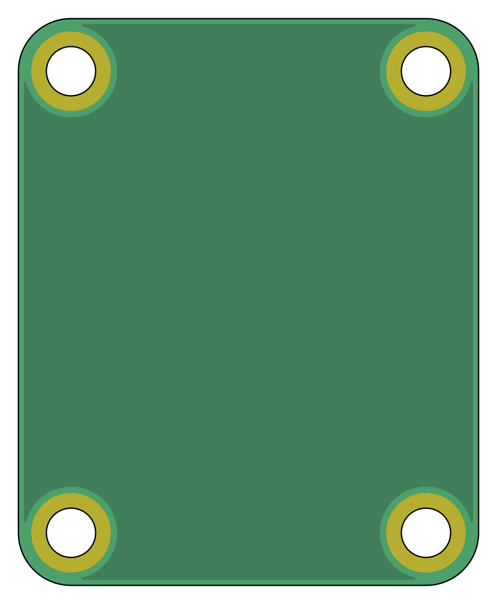
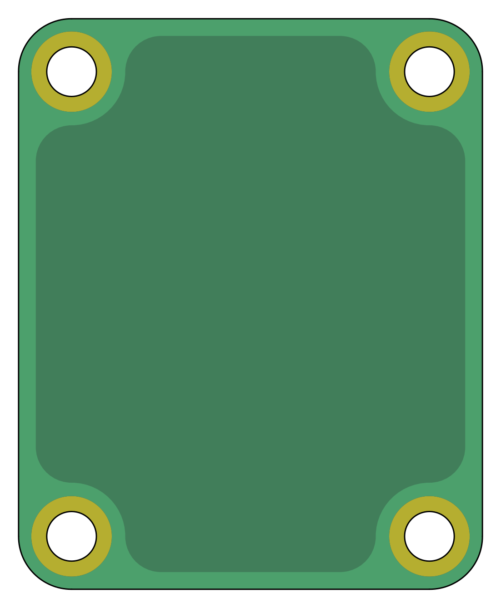

# Template Bread

This is part of the "Modular Breadboard" parent project. 

It's a KiCad template for designing your own modules. PCB contour, Hole size/spacing as well as clearance to copper fills on both sides are critical.Component pins are allowed to protrude a maximum of 3mm below the PCB.

|  |  |
|:---:|:---:|
|Top|Bottom|
